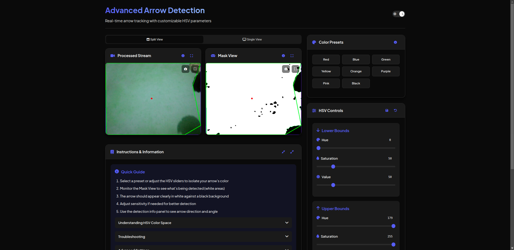

# Arrow Detection System

A real-time arrow detection and tracking system with a modern web interface. This project uses computer vision techniques to detect and analyze arrows in video streams.

## Demonstration

### Application Interface

*Main interface showing the web application layout*

## Tech Stack

### Backend
- **Python 3.8+**
- **Flask**: Web framework for serving the application
- **OpenCV**: Computer vision library for image processing
- **Socket.IO**: Real-time bidirectional communication
- **NumPy**: Numerical computing library

### Frontend
- **HTML5/CSS3**: Modern web interface
- **JavaScript**: Client-side functionality
- **Socket.IO Client**: Real-time updates

## How It Works

The system uses OpenCV and computer vision techniques to detect arrows in real-time:

1. **Video Processing**
   - Captures video feed from a camera
   - Processes each frame in real-time
   - Displays both processed and mask views

2. **Arrow Detection**
   - Uses HSV color space to isolate arrow colors
   - Applies contour detection to find arrow shapes
   - Calculates arrow direction and angle
   - Provides confidence scoring for detections

3. **User Interface**
   - Real-time video display with detection overlay
   - Interactive HSV parameter adjustment
   - Color presets for quick setup
   - Detection metrics dashboard

## Use Cases

This system is designed for various applications:

1. **Navigation Systems**
   - Detecting directional arrows in real-world environments
   - Autonomous navigation assistance
   - Traffic sign recognition

2. **Industrial Applications**
   - Quality control in manufacturing
   - Directional guidance in automated systems
   - Safety monitoring

3. **Research and Development**
   - Computer vision testing
   - Arrow detection algorithm development
   - Real-time video processing experiments

## Features

- Real-time arrow detection and tracking
- HSV color space-based arrow isolation
- Direction and angle detection
- Confidence scoring
- Modern, responsive web interface
- Dark/Light theme support
- Split/Single view modes
- Color presets for common arrow colors
- Interactive HSV parameter adjustment
- Detection metrics dashboard

## Detailed Setup

### Prerequisites
- Python 3.8 or higher
- OpenCV compatible camera
- Modern web browser with JavaScript enabled

### Installation Steps

1. Clone the repository:
```bash
git clone https://github.com/yourusername/ArrowDetection.git
cd ArrowDetection
```

2. Create and activate a virtual environment (recommended):
```bash
python -m venv venv
source venv/bin/activate  # On Windows: venv\Scripts\activate
```

3. Install dependencies:
```bash
pip install -r requirements.txt
```

4. Configure camera settings in `app.py`:
```python
# Default camera settings
camera = cv2.VideoCapture(0)  # Change 0 to your camera index
camera.set(cv2.CAP_PROP_FRAME_WIDTH, 640)
camera.set(cv2.CAP_PROP_FRAME_HEIGHT, 480)
```

5. Run the application:
```bash
python app.py
```

6. Open your web browser and navigate to:
```
http://127.0.0.1:5000
```

## Project Structure

```
ArrowDetection/
├── app.py              # Main Flask application
├── arrowDetection.py   # Arrow Detection Logic
├── requirements.txt    # Python dependencies
├── templates/          # HTML templates
└── README.md           # Project documentation
```

## Configuration

### HSV Parameters
The system uses HSV color space for arrow detection:
- **Hue (0-179)**: Color type
- **Saturation (0-255)**: Color intensity
- **Value (0-255)**: Color brightness

### Color Presets
Pre-configured HSV ranges for common colors:
- Red: `{l_h: 0, l_s: 100, l_v: 100, u_h: 10, u_s: 255, u_v: 255}`
- Blue: `{l_h: 100, l_s: 100, l_v: 100, u_h: 130, u_s: 255, u_v: 255}`
- Green: `{l_h: 40, l_s: 100, l_v: 100, u_h: 80, u_s: 255, u_v: 255}`
- Yellow: `{l_h: 20, l_s: 100, l_v: 100, u_h: 40, u_s: 255, u_v: 255}`

## Troubleshooting

### Common Issues and Solutions

1. **Camera Not Detected**
   - Check camera connection
   - Verify camera permissions
   - Try different camera index in `app.py`
   - Solution: `camera = cv2.VideoCapture(1)` or higher

2. **Poor Detection Accuracy**
   - Ensure consistent lighting
   - Adjust HSV ranges
   - Check for camera focus
   - Solution: Use the sensitivity slider

3. **Web Interface Not Loading**
   - Check if Flask server is running
   - Verify port 5000 is available
   - Clear browser cache
   - Solution: Try different port in `app.py`

4. **Performance Issues**
   - Reduce frame resolution
   - Lower processing frequency
   - Close other resource-intensive applications
   - Solution: Adjust camera settings in `app.py`

### Debug Mode
Enable debug mode for detailed logs:
```python
app.run(debug=True)
```

## Contributing

1. Fork the repository
2. Create a feature branch
3. Commit your changes
4. Push to the branch
5. Create a Pull Request

## License

This project is licensed under the MIT License - see the LICENSE file for details.
